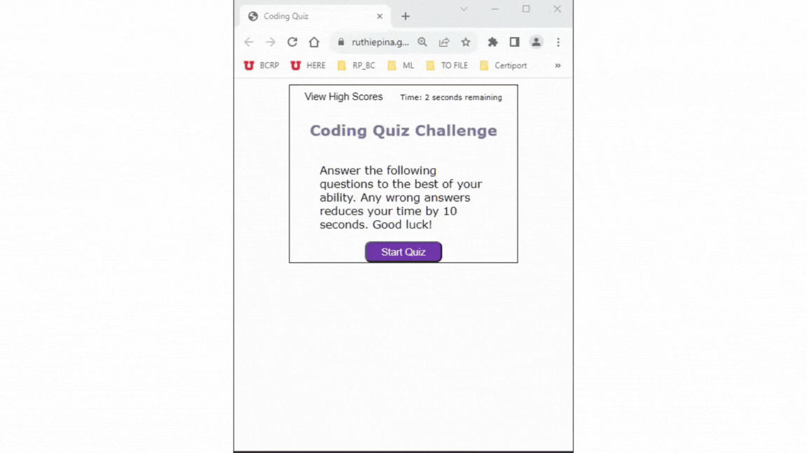

# Coding-Assessment

## Description

An interactive and timed coding quiz with multiple-choice questions.

## Table of Contents

-  [About the Project](#about-the-project)
-  [User Story](#user-story)
-  [Acceptance Criteria](#acceptance-criteria)
-  [Functionality](#functionality)
-  [Access](#access)
-  [Credits](#credits)
-  [License](#license)

## About the Project

This project is a coding assessment built with JavaScript, CSS and HTML. It is designed with multiple-choice questions,
interactive buttons, a timer countdown and score-keeping feature. This app will run a browser window and features
dynamically updated HTML and CSS powered by the JavaScript code. It also features a clean and polished user interface
and it is responsive to multiple screen sizes.

## User Story

-  AS A coding boot camp student
-  I WANT to take a timed quiz on JavaScript fundamentals that stores high scores
-  SO THAT I can gauge my progress compared to my peers

## Acceptance Criteria

-  GIVEN I am taking a code quiz
-  WHEN I click the start button
-  THEN a timer starts and I am presented with a question

-  WHEN I answer a question
-  THEN I am presented with another question

-  WHEN I answer a question incorrectly
-  THEN time is subtracted from the clock

-  WHEN all questions are answered or the timer reaches 0
-  THEN the game is over

-  WHEN the game is over
-  THEN I can save my initials and score

## Functionality

The following animation demonstrates the application functionality: 

## Access

-  The URL of the functional, deployed application:
-  [Coding Quiz](https://ruthiepina.github.io/Coding-Quiz/)

-  The URL of the GitHub repository:
-  https://github.com/ruthiepina/Coding-Quiz

## Credits

Following sources are where I searched for class examples, syntax information, different JavaScript elements, troubleshooting code, etc.

-  https://www.w3schools.com
-  https://coding-boot-camp.github.io/full-stack/github/professional-readme-guide\
-  https://developer.mozilla.org/en-US/
-  https://git.bootcampcontent.com/University-of-Utah/UofU-VIRT-FSF-PT-10-2023-U-LOLC/-/tree/main/04-Web-APIs

## License

MIT License
